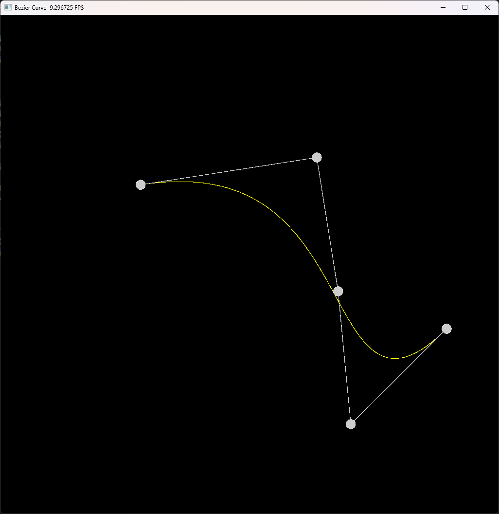

# 作业 4. 贝塞尔曲线

如题，绘制贝塞尔曲线。

**关键词**：Curves, Bezier Curves

**参考资料**：
- 《虎书》 第 15 章（Curves）
- 一个贝塞尔曲线的 Taichi 实现：[https://github.com/Zydiii/LearnTaiChi/blob/master/03/main.py](https://github.com/Zydiii/LearnTaiChi/blob/master/03/main.py)

**题解**：[main.py](./main.py)

> 说明：由于 Taichi 较难实现递归，因此还是采用最简单的迭代实现方式；另外尝试做 Anti-aliasing 但是效果不佳，这部分也未完成。

实现效果：

