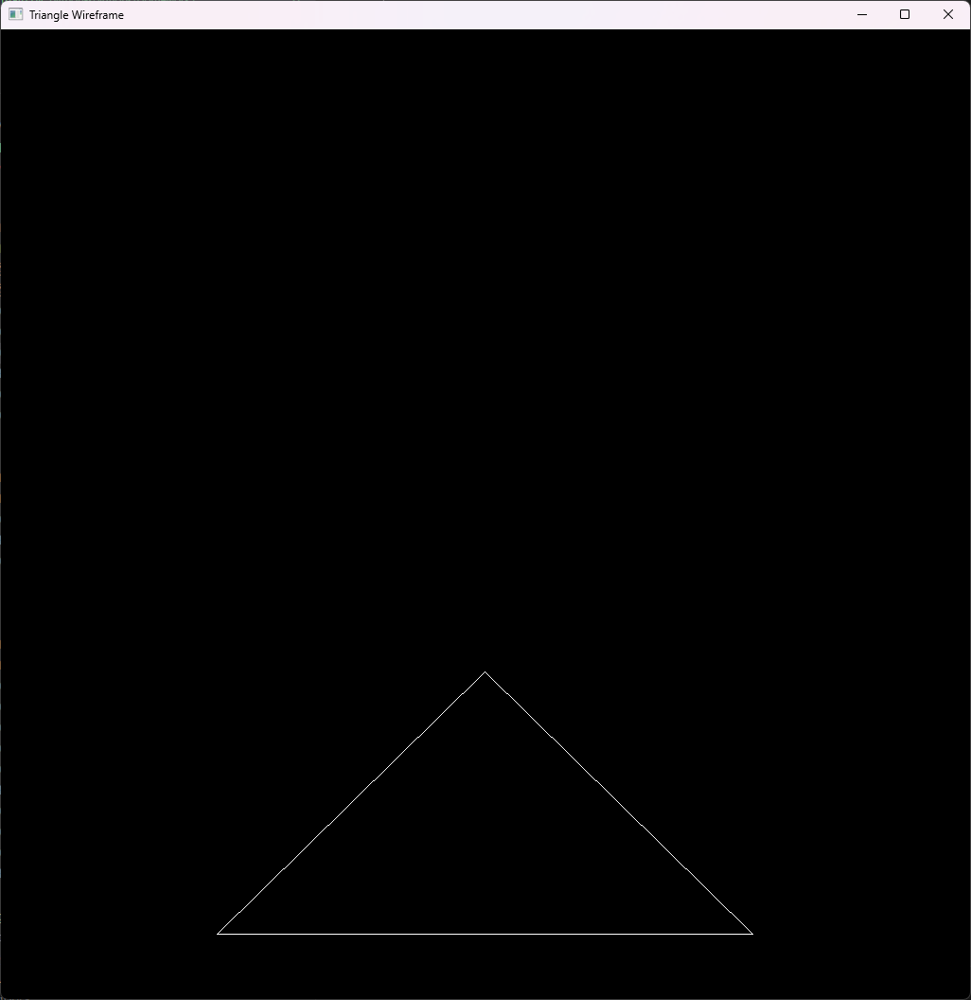
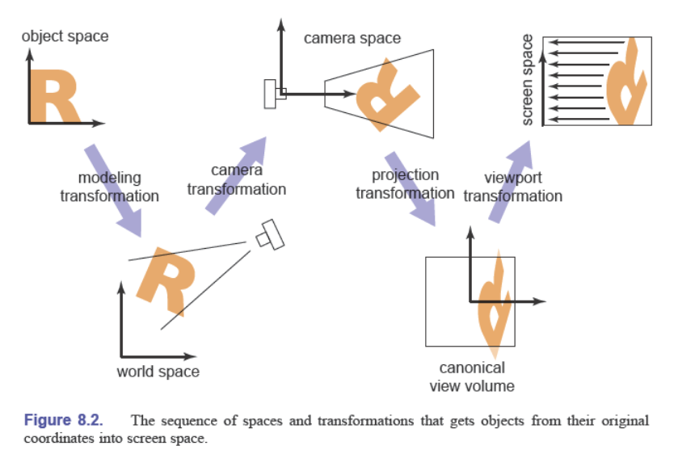

# 作业1. 实现变换矩阵+画三角形线框

熟悉三维渲染中的几个变换矩阵的作用和顺序（model->view->projection->viewport），掌握光栅化的概念以及画线的算法（Bresenham 算法）。

**关键词**：Transformation Matrices，Viewing，Line Rasterization.

**参考资料**： 
- 《虎书》第 7 章（Transformation Matrices），第 8 章（Viewing），第 9 章（The Graphics Pipeline）
- 一个高效的 Bresenham 画线算法实现：https://github.com/miloyip/line/blob/master/line_bresenham.c

**题解**：
- python: [[main.py](./main.py)]

效果如下图所示：

渲染中的变换矩阵：

