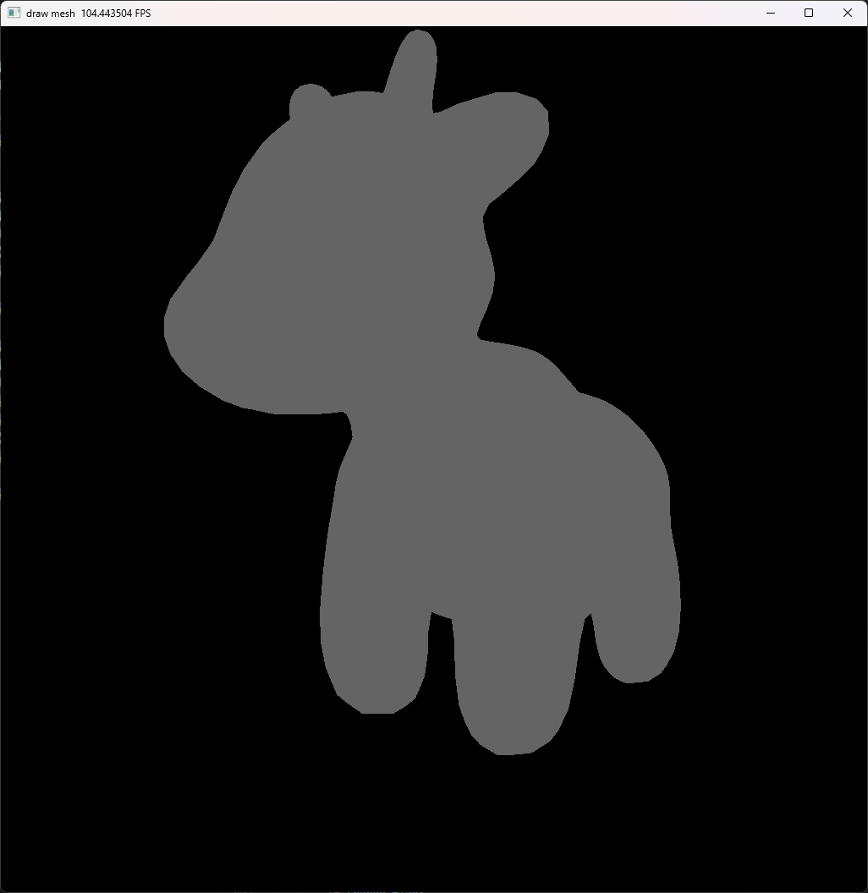
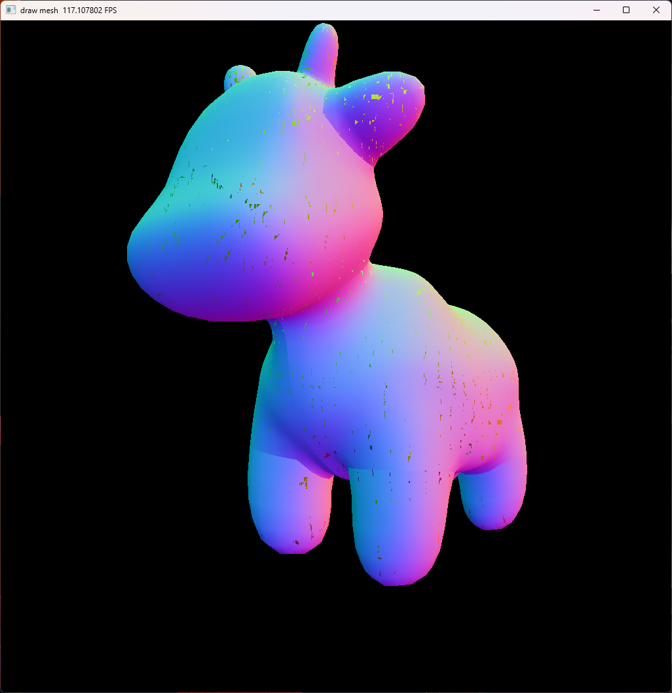
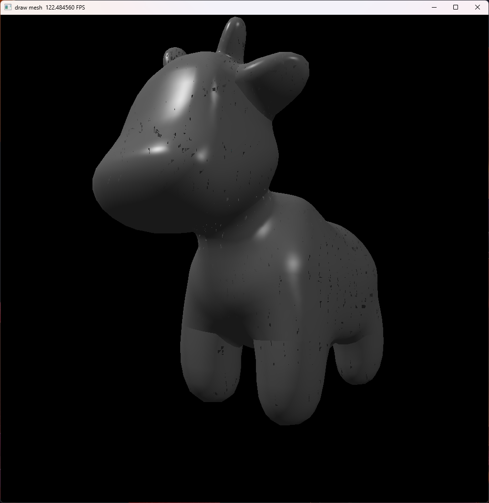
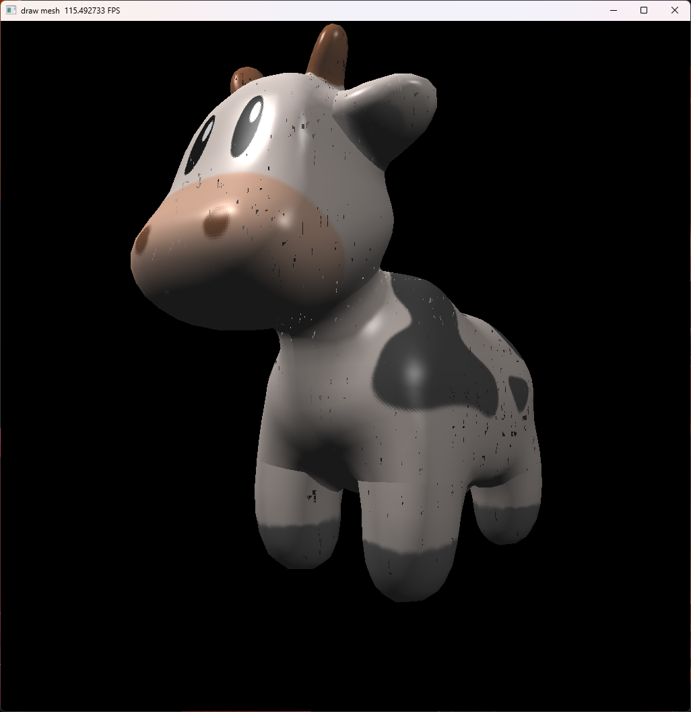
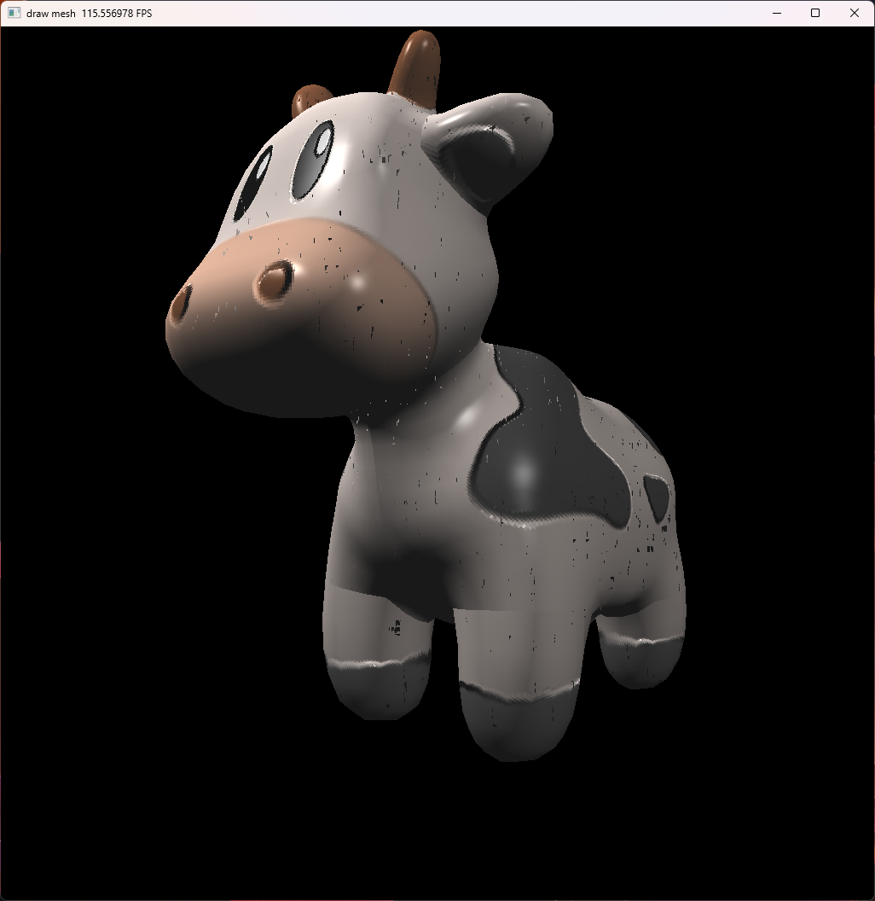
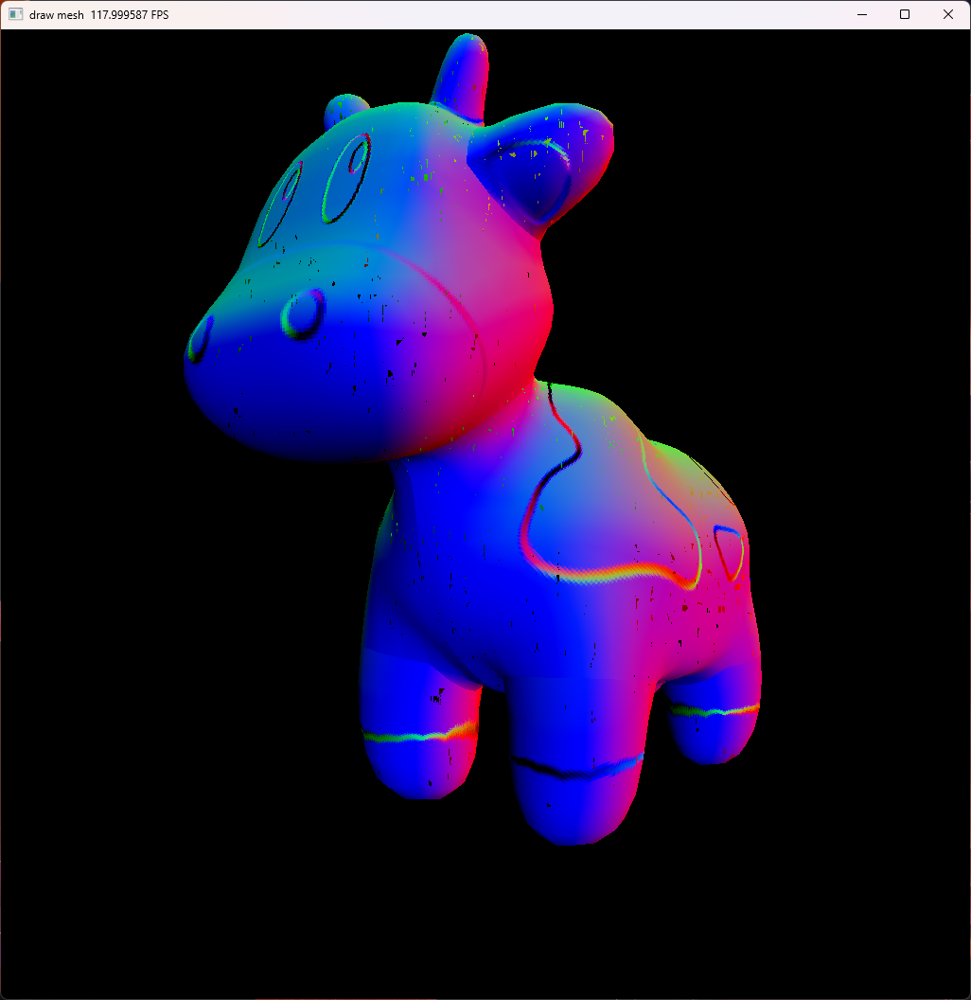

# 作业3. 实现常见着色器

实现模型网格的加载和渲染，实现 Normal Mapping、Bling-Phong 光照模型、Texture Mapping、Displacement Mapping 和 Bump Mapping 等常见着色器。

**关键词**: Bling-Phong Shading, Texture Mapping

**参考资料**：
- 《虎书》 第 5 章（Surface Shading），第 11 章（Texture Mapping），第 17 章（Using Graphics Hardware）

**题解**：[main.py](./main.py)（深度检测可能有问题）

无着色器：

Normal Mapping：

Bling-Phong Shading:

Texture Mapping:

Displacement Mapping:

Bump Mapping：

