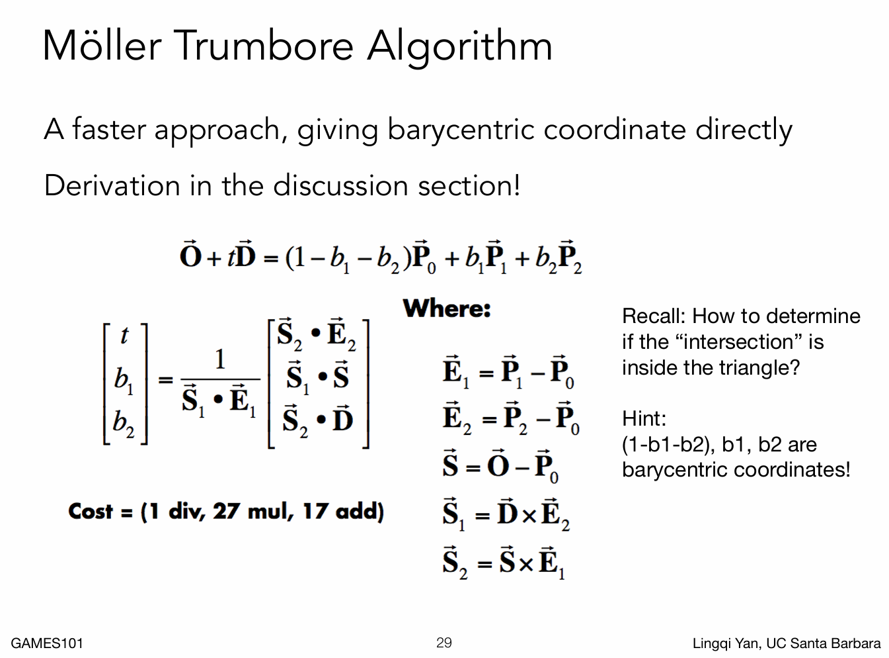

# 作业5. Whitted-style 光线追踪

实现 Whitted-style RayTracing。重点是实现光线与球和三角形的求交，难点在于用栈替代递归。

**关键词**：Ray-Tracing, Physical-Based Rendering, Recursion, Bling-phong shading, Moller-Trumbore Algorithm

**参考资料**：
- 《虎书》 第 4 章（Ray Tracing），第 5 章（Surface Shading），第 14 章（Physical-Based Rendering）
- 用 Taichi 实现 Whitted-style RayTracing，用手动维护栈的方式实现递归逻辑： [code](https://github.com/erizmr/taichi_ray_tracing/blob/master/3_2_whitted_style_ray_tracing.py)
- [Taichi: 从零开始的光线追踪](https://shao.fun/blog/w/taichi-ray-tracing.html)
- [Ray Tracing in One Weekend](https://raytracing.github.io/books/RayTracingInOneWeekend.html)

**题解**：[main.py](./main.py)

Moller-Trumbore 三角形快速求交算法：

渲染结果：

